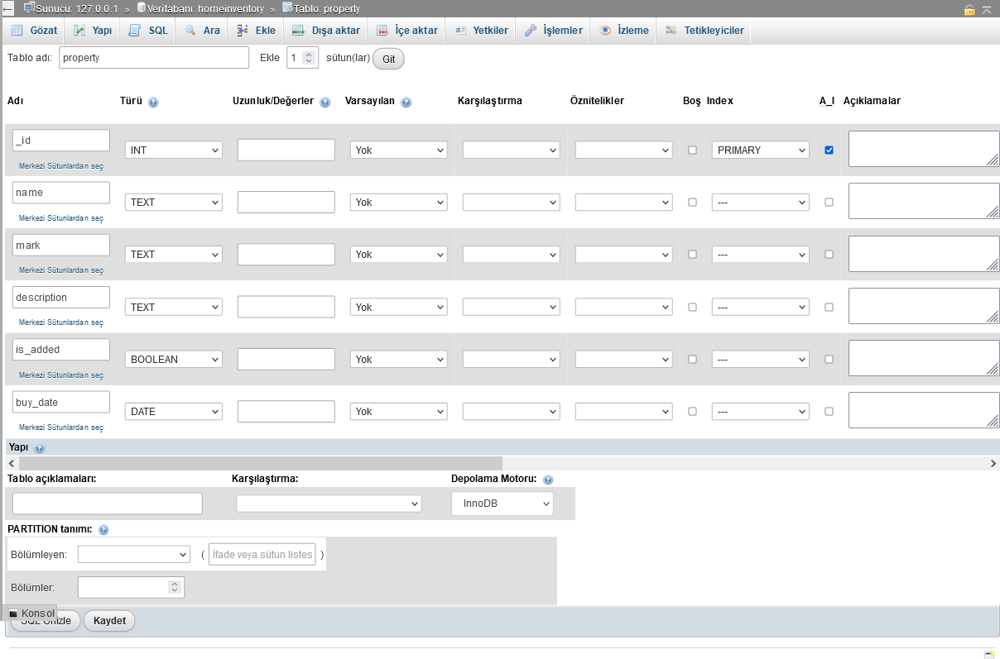

# Home Inventory

Bu projede Flask ve Flask-restfull API kullanarak ev envanteri yapmtım. Javascript'i yeni öğrenmeye başladığım için React veya Angular ile yazamadığım için mecburen flask ile yazdım.

## Proje için gereklilikler
* Python3
* XAMPP

## Proje nasıl çalıştırılır

### Database
Önceden kurduğumuz XAMPP programını açıp gerekli servisleri başlatıyoruz.

servislerimiz başlattıktan sonra phpmyadmin sayfasına gidip Database'imizi kuruyoruz

Database'imiz içerisinde bir tablo oluşturuyoruz


### Python3

öncelikle gerekli kütüphaneleri kurmak için
```python3 -m pip install -r requirements.txt```

ve sunucumuzu başlatıyoruz

```python3 main.py```

